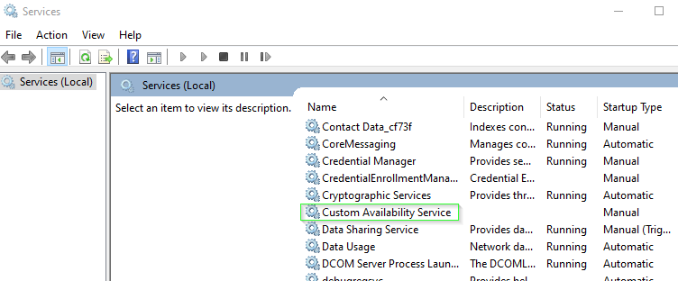
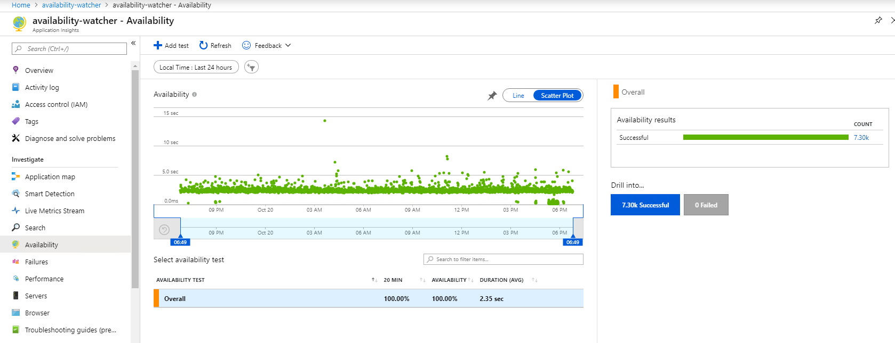
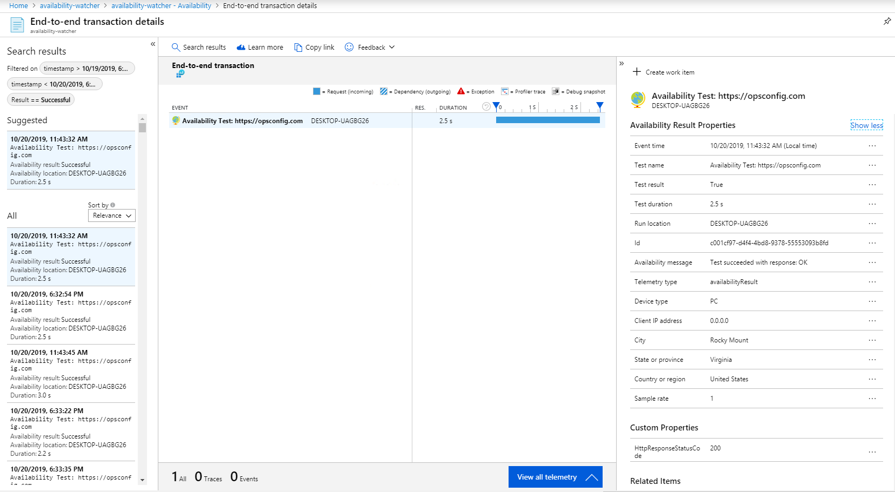

# Availability-watcher-simplefile

## Visual Studio 2019

If running from VS 2019 just make sure you have a valid config.txt and ikey.txt file in the `Availability-Watcher-simplefile\Availability-Watcher` directory. 

The ikey.txt file should contain a single line with no spaces just conisting of your Application Insights instrumentation key in the form: `afc62271-f6c9-55aa-5555-f573727e0b3f`. The config.txt file should contain your list of endpoints with each endpoint you want to test on a separate line (again not the way I plan to do this eventually, but this is a simple proof of concept). So when opened the file should look like:
```
https://microsoft.com
https://docs.microsoft.com
https://bing.com
https://outlook.com
```
When running via Visual Studio you will see output like this:


## Test .exe locally

If you don't want to look at the code in Visual Studio and you just want to try out the very basic functionality as it currently stands you can do the following:
1. Go to Availability-Watcher-simplefile\Availability-Watcher\bin\Release\netcoreapp3.0\.
2. If they are not currently present add an ikey.txt file and config.txt file to this directory following the same instructions from the Visual Studio section above except place the files in the same directory as the Availability-Watcher.exe.
3. Right-click and run Availability-Watcher.exe as admin.

When running direct via the .exe it should look like this:


## Run as a Windows Service

If you don't want to look at the code in Visual Studio and you just want to try out the very basic functionality as it currently stands you can do the following:
1. Go to Availability-Watcher-simplefile\Availability-Watcher\bin\Release\netcoreapp3.0\
2. If they are not currently present add an ikey.txt file and config.txt file to this directory following the same instructions from the Visual Studio section above except place the files in the same directory as the Availability-Watcher.exe.
3. Open an administrative command prompt.
4. Run `sc create <new_service_name> binPath "path-to-availability-watcher\availability-watcher.exe"`


5. services.msc
6. Start your service



## What you will see in the console once your service is running:

- Summary Availabilty data with individual transaction durations:



- Ability to drill into end-to-end transaction details:



- Azure Monitor Logs stores all the availability transactions which can be easily accessed via Log Analytics + Kusto queries:


One can then build custom log and metric based alerts to notify as soon as an outage is detected.

